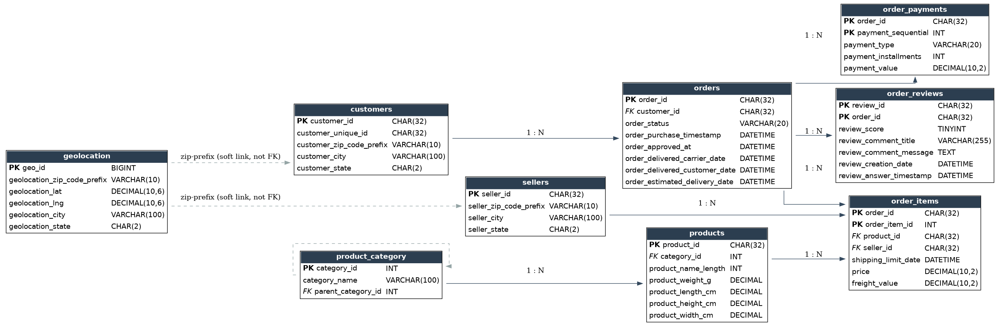
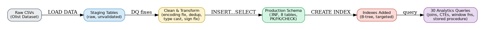
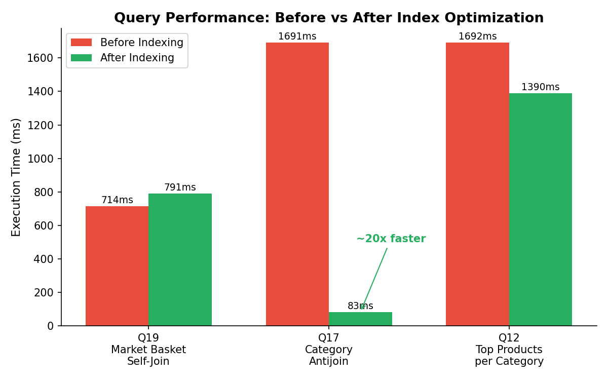

# ShopHub Analytics — Assignment 1: SQL Mastery

Database Engineering project on the Brazilian E-Commerce Public Dataset
(Olist). MySQL 8.0.

  

## Entity-Relationship Diagram



## Data Pipeline



## Optimization Results



Full before/after `EXPLAIN ANALYZE` breakdown in `reports/optimization_report.md`.

## How to run this project

1. Create the database and schema:
   ```
   mysql < 01_schema/schema.sql
   ```
2. Load raw CSVs into staging tables (edit file paths to match where
   your CSVs live — this project loaded them from
   `/var/lib/mysql-files/`, MySQL's default `secure_file_priv` dir):
   ```
   mysql shophub_analytics < 02_data_cleaning/01_load_staging.sql
   ```
3. Clean & transform staging data into the production schema:
   ```
   mysql shophub_analytics < 02_data_cleaning/02_clean_transform.sql
   ```
4. Run the analysis queries (Parts A-F), in any order:
   ```
   mysql shophub_analytics < 03_queries/part_a_design_and_dictionary.sql
   mysql shophub_analytics < 03_queries/part_b_manipulation_retrieval.sql
   mysql shophub_analytics < 03_queries/part_c_aggregations.sql
   mysql shophub_analytics < 03_queries/part_d_joins.sql
   mysql shophub_analytics < 03_queries/part_e_subqueries_ctes.sql
   mysql shophub_analytics < 03_queries/part_f_window_functions.sql
   ```
5. Stored procedure & optimization (Part G):
   ```
   mysql shophub_analytics < 04_optimization/29_discount_procedure.sql
   mysql shophub_analytics < 04_optimization/30_indexes_and_explain.sql
   ```

## Folder structure

```
01_schema/                 3NF schema - 8 core tables + staging tables, PK/FK/CHECK constraints
02_data_cleaning/          Raw CSV -> staging -> cleaned/typed production tables
03_queries/                All 30 assignment queries, organized by Part A-F
04_optimization/           Stored procedure (Q29) + indexes/EXPLAIN ANALYZE (Q30)
ERD/                       Entity-relationship diagram (erd_diagram.png)
reports/
  data_quality_report.md   12 documented data quality issues + fixes
  data_dictionary.csv      Full column-level data dictionary (generated from live schema)
  optimization_report.md   Before/after EXPLAIN ANALYZE for 3 slow queries
```

## Important note on source data

`olist_customers_dataset.csv` was **not** included in the CSV files
provided for this assignment run (only 7 of the 8 core files + 2
accidental duplicate uploads were supplied). This is documented as
**Data Quality Issue #1** in `reports/data_quality_report.md`.

To keep the project runnable end-to-end, the `customers` table was
reconstructed from the distinct `customer_id` values in `orders`, with
`customer_unique_id` set equal to `customer_id` as a placeholder (the
real Olist file maps many `customer_id`s to one `customer_unique_id`
for repeat buyers - that mapping cannot be recovered without the
source file). A handful of queries (Q7, Q9, Q21, Q24, Q26) are affected
by this and each one calls out the limitation directly in its SQL
comments - the query logic itself is written correctly for the full
schema and needs no changes if the real customers file is added later.

## Data quality issues found & fixed (12 total, see full report)
1. Missing customers source file -> reconstructed from orders
2. Non-UTF-8 encoding in 2 files -> re-encoded
3. Sign-inversion bug in 100% of geolocation lat/lng -> corrected
4. Inconsistent date formats across files (orders vs. reviews) -> per-table parsing
5. Duplicate file uploads (geolocation, order_payments) -> deduplicated
6. Placeholder review text ("A") -> flagged, not fabricated
7. Missing product_category_name (610 rows) -> mapped to 'unknown'
8. Missing product dimensions (2 rows) -> left NULL, documented
9. Payment/order-total mismatch - potential fraud (1,075 orders) -> query built (Q10)
10. Orders with no payment row (1) -> flagged
11. `delivered` status with NULL delivery date (8) -> flagged
12. Embedded commas/quotes in free text -> handled via CSV quoting rules

## Optimization highlights (see reports/optimization_report.md)
Three composite B-tree indexes were added after profiling with
`EXPLAIN ANALYZE`. The category-exclusion antijoin query (Q17) went
from **1,691 ms -> 83 ms (~20x faster)**; the top-products-per-category
query (Q12) improved ~18%; the market-basket self-join (Q19) showed no
meaningful change, and the report explains why honestly rather than
only showing wins.
